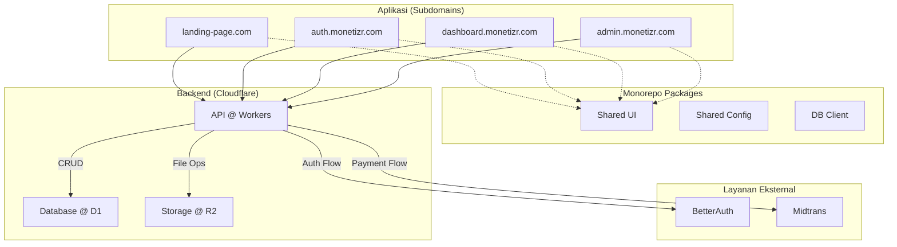

# Product Requirement Document (PRD): Platform Creator-Promoter

**Versi:** 0.2
**Tanggal:** 15 Juni 2025

### 1. Ringkasan & Tujuan

Platform ini bertujuan untuk menjadi jembatan antara **Konten Kreator** dan **Promotor** melalui model imbalan berbasis performa.

*   **Visi:** Membangun ekosistem promosi kreator yang paling efektif, terpercaya, dan scalable di Indonesia.
*   **Masalah:** Kreator kesulitan mengukur ROI promosi; promotor kesulitan mencari peluang monetisasi yang fleksibel.
*   **Solusi:** Platform dengan arsitektur multi-subdomain yang terukur, tracking akurat, dan sistem pembayaran yang aman.

### 2. Arsitektur Teknis (Multi-Subdomain Monorepo)

Kita akan menggunakan arsitektur **Monorepo** untuk mengelola beberapa aplikasi Next.js dalam satu basis kode. Ini memberikan pemisahan yang jelas antar layanan sambil memungkinkan berbagi kode (komponen UI, utilitas) untuk konsistensi.

*   **Struktur:** Monorepo dengan `pnpm workspaces`.
*   **Aplikasi (Subdomain):**
    *   `monetizr.com`: Aplikasi **Landing Page** (`apps/landing`).
    *   `auth.monetizr.com`: Aplikasi **Otentikasi** (`apps/auth`).
    *   `dashboard.monetizr.com`: **Dashboard** untuk Kreator & Promotor (`apps/dashboard`).
    *   `admin.monetizr.com`: **Panel Admin** (`apps/admin`).
*   **Kode Bersama:**
    *   `packages/ui`: Komponen React (shadcn/ui).
    *   `packages/config`: Konfigurasi bersama (ESLint, TypeScript).
    *   `packages/db`: Skema dan klien database.
*   **Teknologi Inti:**
    *   **Framework:** **Next.js** (App Router)
    *   **Deployment:** **Cloudflare Pages**
    *   **Backend Logic:** **Cloudflare Workers**
    *   **Database:** **Cloudflare D1**
    *   **Penyimpanan File:** **Cloudflare R2**
    *   **Otentikasi:** **BetterAuth**
    *   **Pembayaran:** **Midtrans**

#### Diagram Arsitektur Baru

```mermaid
graph TD
    subgraph "Aplikasi (Subdomains)"
        A[landing-page.com]
        B[auth.monetizr.com]
        C[dashboard.monetizr.com]
        D[admin.monetizr.com]
    end

    subgraph "Monorepo Packages"
        UI[Shared UI]
        CONFIG[Shared Config]
        DB_CLIENT[DB Client]
    end

    subgraph "Backend (Cloudflare)"
        W[API @ Workers]
        D1[Database @ D1]
        R2[Storage @ R2]
    end

    subgraph "Layanan Eksternal"
        AUTH[BetterAuth]
        PAY[Midtrans]
    end

    A --> W; B --> W; C --> W; D --> W;
    A -.-> UI; B -.-> UI; C -.-> UI; D -.-> UI;
    W -- CRUD --> D1
    W -- File Ops --> R2
    W -- Auth Flow --> AUTH
    W -- Payment Flow --> PAY
```

### 3. Rincian Fitur & Checklist MVP

---
**✅ Modul 1: Akun & Otentikasi (`auth.monetizr.com`)**
- [ ] `[MVP]` Halaman Login & Pendaftaran (via BetterAuth).
- [ ] `[MVP]` Alur lupa kata sandi.
- [ ] `[MVP]` Pengalihan pengguna ke dashboard setelah login berhasil.

---
**✅ Modul 2: Dashboard Pengguna (`dashboard.monetizr.com`)**
- **Umum:**
    - [ ] `[MVP]` Manajemen profil dasar (nama, bio).
    - [ ] `[MVP]` Promotor: Input rekening bank untuk penarikan dana.
- **Untuk Kreator:**
    - [ ] `[MVP]` Formulir pembuatan kampanye (PPC).
    - [ ] `[MVP]` Upload materi kampanye ke Cloudflare R2.
    - [ ] `[MVP]` Integrasi Midtrans Snap untuk deposit dana.
    - [ ] `[MVP]` Dashboard kampanye (melihat budget, sisa dana, total klik).
    - [ ] `[Post-MVP]` Model imbalan lain (PPA, PPV).
- **Untuk Promotor:**
    - [ ] `[MVP]` Halaman eksplorasi untuk mencari kampanye.
    - [ ] `[MVP]` Halaman detail kampanye.
    - [ ] `[MVP]` Fungsi untuk bergabung & mendapatkan link tracking unik.
    - [ ] `[MVP]` Dashboard penghasilan (total klik, estimasi pendapatan).
    - [ ] `[MVP]` Fungsi untuk mengajukan penarikan dana.

---
**✅ Modul 3: Panel Admin (`admin.monetizr.com`)**
- [ ] `[MVP]` Login khusus untuk admin.
- [ ] `[MVP]` Dashboard utama (statistik platform).
- **Manajemen Pengguna:**
    - [ ] `[MVP]` Melihat daftar semua pengguna (Kreator & Promotor).
    - [ ] `[Post-MVP]` Menangguhkan atau memblokir pengguna.
- **Manajemen Kampanye:**
    - [ ] `[MVP]` Melihat semua kampanye yang sedang berjalan.
    - [ ] `[Post-MVP]` Menghentikan atau meninjau kampanye yang melanggar aturan.
- **Keuangan:**
    - [ ] `[MVP]` Melihat riwayat transaksi (deposit & penarikan).
    - [ ] `[MVP]` Dashboard untuk melacak *platform fee* yang terkumpul.
    - [ ] `[Post-MVP]` Menyetujui atau menolak permintaan penarikan dana secara manual.

---
**✅ Modul 4: Landing Page (`monetizr.com`)**
- [ ] `[MVP]` Halaman utama yang menjelaskan fitur dan keuntungan platform.
- [ ] `[MVP]` Tombol ajakan bertindak (CTA) yang mengarah ke halaman pendaftaran (`auth.monetizr.com`).
- [ ] `[Post-MVP]` Halaman FAQ dan Blog.

---
**✅ Modul 5: Backend & Inti**
- [ ] `[MVP]` Sistem tracking link unik (via Cloudflare Worker).
- [ ] `[MVP]` Sistem dompet internal untuk setiap pengguna.
- [ ] `[MVP]` Kalkulasi pendapatan promotor dan *platform fee*.
- [ ] `[MVP]` API untuk semua operasi CRUD (Create, Read, Update, Delete).
- [ ] `[Post-MVP]` Sistem anti-fraud dasar.

---
### 4. Rencana Pelaksanaan (Roadmap)

| Fase                      | Durasi (Estimasi) | Fokus Utama                                                              | Checklist                                                                                                     |
| ------------------------- | ----------------- | ------------------------------------------------------------------------ | ------------------------------------------------------------------------------------------------------------- |
| **Fase 1: Fondasi Monorepo** | 1-2 Minggu        | Setup struktur proyek, aplikasi, dan package bersama.                    | `[ ]` Setup pnpm workspace   `[ ]` Buat 4 aplikasi Next.js   `[ ]` Konfigurasi shared `eslint` & `tsconfig` |
| **Fase 2: Otentikasi & User** | 2-3 Minggu        | Mengintegrasikan `auth.monetizr.com` dan profil dasar di `dashboard`.      | `[ ]` Integrasi BetterAuth   `[ ]` Buat halaman login & daftar   `[ ]` Buat halaman profil pengguna     |
| **Fase 3: Alur Inti Kampanye** | 3-4 Minggu        | Membangun alur dari pembuatan kampanye hingga promosi.                   | `[ ]` Buat alur kampanye   `[ ]` Implementasi tracking link   `[ ]` Dashboard dasar untuk Kreator/Promotor |
| **Fase 4: Monetisasi**      | 2-3 Minggu        | Mengintegrasikan pembayaran dan penarikan dana.                          | `[ ]` Integrasi Midtrans (Deposit & Payout)   `[ ]` Sistem dompet & riwayat transaksi                     |
| **Fase 5: Panel Admin**       | 1-2 Minggu        | Membangun fitur dasar untuk `admin.monetizr.com`.                        | `[ ]` Login admin   `[ ]` Manajemen user & kampanye   `[ ]` Dashboard keuangan admin                  |
| **Fase 6: Uji & Rilis**     | 1-2 Minggu        | Pengujian End-to-End di semua aplikasi dan peluncuran MVP.               | `[ ]` Testing E2E   `[ ]` Perbaikan bug   `[ ]` Deploy ke Cloudflare                                 |